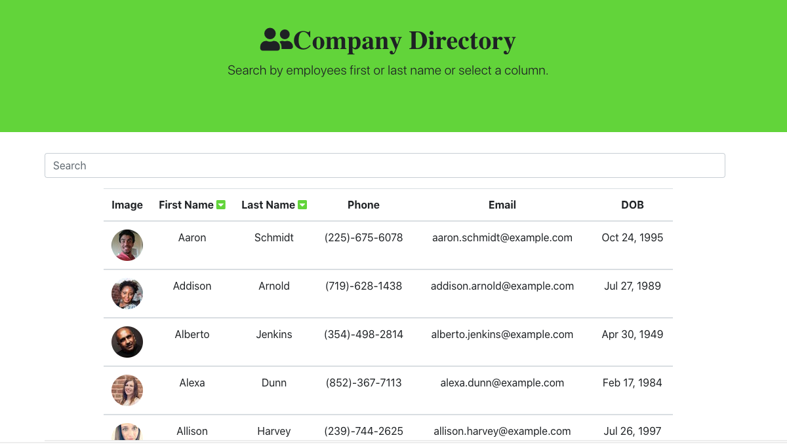

# Employee Directory #
  

  
  ## View Program ##
  
  

  * [Github Page Link](https://tbsanders5.github.io/employeedirectory/)

  ## Description ##

  React web application use to search through a directory of employees.

  ## Table Of Contents ##

  - [Description](#Description)
  - [Installation](#Installation)
  - [Usage](#Usage)
  - [Contributors](#Contributors)
  - [License](#License)
  - [Tests](#Tests)
  - [Repository](#Repository)
  - [Questions](#Questions)

  ## Installation ##

  1. Application opens on github pages, no installation.
 
  ## Usage ##

  1. Search through employee list through the search bar
  1. Filter by last or first name by clicking arrows to sort

  ## Contributors ##
  * [Aaron Platt](https://github.com/aaronkplatt)
  * [Matthew Rogers](https://github.com/Rogers-Development-Services)
  * [Nancy Lambert-Brown](https://github.com/n-lambert)
  * [Plover Brown](https://github.com/rebgrasshopper)
  * [Nicholas Konzen](https://github.com/NTKonzen)
  * [Talia Vazquez](https://github.com/taliavazquez)
  * [ShieldsIO](https://shields.io/category/license) 
  * [Nodejs.org](https://nodejs.org/en/)
  * [MongoDB]
  * [Express]
  * [ReactJS]
  ## License ##

  https://api.github.com/licenses/mit

  ## Tests ##

  Using jest or mocha you can run tests through the application using npm test.

  ## Repository ##

  - [My Projects Repository](https://github.com/tbsanders5/employeedirectory)

  ## Questions ##

  
  - Timothy Sanders
  - [My Profile](https://github.com/tbsanders5)
  - tbsanders5@gmail.com